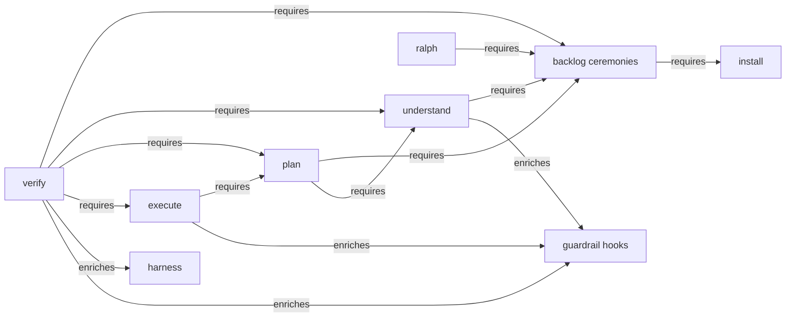

# The engine's capabilities

This directory holds one **architecture card** per capability. A card is what a session receives when a
task touches that capability, so that the shape of the thing does not have to be rediscovered by reading
everything or by breaking something.

This file is the map the cards are filed under, and the place the rule for writing one lives.

## The map

Nodes are **capabilities** — the units a session invokes, or that run on their own. Arrows come in two
kinds and no third:

- **requires** — the source cannot do its job without the target.
- **enriches** — the source is better with the target and **degrades** without it, in a way the card names.

**`conform` is not a node**, and the omission is deliberate rather than forgotten: it has no command of
its own and runs inside the `plan` skill, which also advances the sheet past it. A node nothing can invoke
would misdescribe what this map is — an index of capabilities, not of phases.

The arrows are drawn to make later decisions possible, not to make them. Decoupling anything this map
shows as *requires* is its own task; nothing here proposes one.

## What a card is

Four blocks, in this order, under a `## Nano` block:

1. **What it is** — the pieces the capability is made of, each named by its file.
2. **The artifacts** — every artifact the capability produces or consumes, with its inputs and its outputs.
3. **The homes table** — one row per concept the capability is made of, against every file that carries
   that concept. This is the block that turns *change this capability* into a list to tick.
4. **External dependencies** — what the capability needs from the others, and **what it degrades to
   without each**. An `enriches` arrow on the map above is only honest if this block names the degradation.

The `## Nano` block is **derived from the body**: one line per body section, regenerated in the same edit
that changes the body. Two levels inside one diff is the only defence against an index drifting from the
thing it indexes — the same trade the steering `## Nano` blocks already make.

### The budget

A card is read on every task that touches its capability, so it is bounded:

| | Ceiling | Why |
|---|---|---|
| `## Nano` | **10 lines** | Re-read on every task touching the capability, whether or not the body is opened. |
| Body | **900 words**, counting no row of the homes table | The four blocks are a description, not an essay. Where the reason for a rule is long, it belongs with the rule, not here. |
| Homes table | **unbounded** | It grows only when the engine grows a home. A ceiling here would be a ceiling on telling the truth. |

The ceilings are checked by the conformance suite. They live here rather than in the shipped engine
because a card is a document only this repository has: an adopting project receives the protocols, not
this directory, and a rule about a document type they will never write is weight.

## The cards

| Capability | Card |
|---|---|
| verify | [verify.md](verify.md) |
